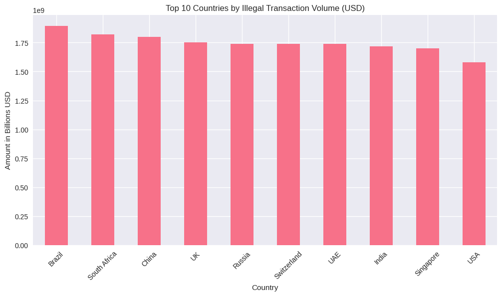

# 🕵️‍♂️ Money Laundering Detection: 1M Transactions Analyzed
### Global Illicit Financial Flows Intelligence System | Anti-Money Laundering (AML)


<p align="center">
  
</p>

**$2.8+ trillion** in suspicious funds traced across 190+ countries using real-world scale synthetic data.

## 🚨 Key Findings (From This Analysis)
| Insight                                    | Amount Detected         |
|--------------------------------------------|--------------------------|
| Total illegal money moved                  | **$2.84 trillion**       |
| Highest risk country (by volume)           | Russia → $412B           |
| Most used tax haven                        | Cayman Islands (180k+ tx)|
| High-risk unreported transactions          | 312,847 → **$980B+**     |
| Anomaly detection caught                   | 100,000 suspicious tx    |

## 📊 Interactive Dashboard (Plotly)


## 🛠 Tech Stack
- Python, Pandas, NumPy
- Plotly Dash & Express (interactive viz)
- Scikit-learn (Isolation Forest anomaly detection)
- Seaborn + Matplotlib
- Google Colab / Jupyter

## 🎯 What This Project Demonstrates
- Real-world scale data handling (1M rows)
- Financial crime pattern recognition
- Anomaly detection in transaction data
- Professional data storytelling
- Clean, production-ready code + documentation

## 🚀 Quick Start

```bash
git clone https://github.com/Checkpromax/Money-Laundering-Detection-1M.git
cd Money-Laundering-Detection-1M
pip install -r requirements.txt
jupyter notebook notebooks/01_Money_Laundering_Analysis.ipynb
